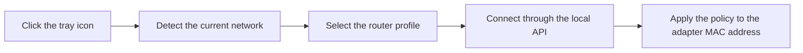

<p align="center">
  <strong>English</strong> · <a href="README_RU.md">Русский</a>
</p>

<p align="center">
  
</p>

<h1 align="center">RouterTray</h1>

<p align="center">
  <strong>Quickly switch Keenetic and Netcraze access policies from the Windows tray.</strong>
</p>

<p align="center">
  A small utility that saves you from opening the router web interface every time.
</p>

<p align="center">
  <a href="https://github.com/den67rus/routertray/actions/workflows/release.yml"></a>
  
  <a href="LICENSE"></a>
</p>

<p align="center">
  <a href="https://github.com/den67rus/routertray/releases"><strong>Download</strong></a>
  ·
  <a href="#quick-start">Quick start</a>
  ·
  <a href="#troubleshooting">Troubleshooting</a>
</p>

<p align="center">
  
</p>

If your router has several access policies, RouterTray puts them in the system tray. Click the icon and choose a policy. The router applies it to the current PC, and a checkmark shows which policy is active.

> [!NOTE]
> RouterTray is not a VPN client and does not route traffic itself. It only switches existing Keenetic or Netcraze policies for the MAC address of the selected network adapter.

## Features

- **Switch policies with one click.** A left-click on the icon opens a short menu without extra windows.
- **Work with several routers.** Create a separate profile with its own settings for home, work, or another network.
- **Select the profile automatically.** Bind a profile to a Windows network, and RouterTray will switch to it when you connect.
- **Find the router through the gateway.** Leave the URL empty, and RouterTray will use the gateway of the selected network interface.
- **Use the right adapter.** Let RouterTray choose automatically, or select Ethernet, Wi-Fi, or another interface yourself.
- **Sign in with a password or token.** Token authentication is available starting with firmware 5.2.
- **Keep secrets out of plain text.** Passwords and tokens are protected with Windows DPAPI.
- **Start with Windows if you want.**
- **Stay up to date automatically.**

## Tray controls

Left-click the icon to open the quick policy picker. Right-click it to access router profiles and network interfaces.

<p align="center">
  
</p>

| Action | Result |
| --- | --- |
| **Left-click the tray icon** | Opens the quick policy picker. |
| **Right-click → Router profiles** | Enables automatic selection or lets you change the profile manually. |
| **Right-click → Interfaces** | Lets you choose the network adapter RouterTray will use. |
| **Right-click → Policies** | Opens the same list of policies in the context menu. |

## Router profiles

A router profile stores the connection details for one router: its address, authentication method, login and password or access token, and the selected network interface.

You can bind several Windows networks to one profile, such as home Wi-Fi and wired Ethernet. When the PC connects to one of them, RouterTray uses the credentials from the bound profile. Each network can be bound to only one profile.

<p align="center">
  
</p>

## Quick start

### 1. Install RouterTray

Installers and portable versions are published on the [Releases page](https://github.com/den67rus/routertray/releases). The x64 version is right for most PCs.

| Device | Installer asset | Portable asset |
| --- | --- | --- |
| Most Intel/AMD PCs | `RouterTray.App-win-x64-Setup.exe` | `RouterTray.App-win-x64-Portable.zip` |
| Windows on ARM | `RouterTray.App-win-arm64-Setup.exe` | `RouterTray.App-win-arm64-Portable.zip` |
| 32-bit Windows | `RouterTray.App-win-x86-Setup.exe` | `RouterTray.App-win-x86-Portable.zip` |

The installer does not require administrator rights and installs RouterTray only for the current user.

### 2. Prepare your router

First, create the policies you want to switch between in the Keenetic or Netcraze web interface. RouterTray works with existing policies and does not change their settings.

For login and password authentication, you can use the administrator account or create a separate user for RouterTray. Set a username and password, then enable only **Web interface** access. RouterTray does not need the other permissions.

<p align="center">
  
</p>

On firmware 5.2 or newer, you can use an access token instead of a login and password.

### 3. Configure a profile

1. Start RouterTray and find the blue **R** icon in the notification area. It may be inside the tray overflow menu.
2. Right-click the icon and select **Settings**.
3. Enter a name for the profile.
4. Enter the router URL. If it is the router for your current network, you can leave the field empty and RouterTray will try to find it through the gateway.
5. Select the sign-in method and enter your credentials.
6. If you have several profiles, select **Bind current network**.
7. Select **Save**.

### 4. Switch a policy

Left-click the tray icon and select a policy. Choose **Default** to remove the explicit policy assignment and return the current PC to the router's default behavior.

## How it works

RouterTray goes through a few steps when you switch a policy.



1. RouterTray checks which network the PC is connected to, such as your home Wi-Fi or a wired network.
2. It uses that network to select the linked router profile. The profile contains the router address, sign-in details, and network adapter to use.
3. RouterTray connects through the local API and loads the available policies.
4. After you choose a policy, the router assigns it to the network adapter's MAC address. The MAC address is the identifier the router uses to recognize this PC.

If you use Ethernet, Wi-Fi, or virtual adapters at the same time, you can select the router profile and adapter manually.

## Compatibility

| Component | Support |
| --- | --- |
| Operating system | Windows |
| Architectures | x64, x86, ARM64 |
| Router | Keenetic or Netcraze with a local RCI API |
| Authentication | NDW2/NDW4; access tokens require firmware 5.2 or newer |

## Where settings are stored

- Settings are stored in `%LOCALAPPDATA%\RouterTray\appsettings.json`.
- Logs are stored in `%LOCALAPPDATA%\RouterTray\routertray.log`.
- Passwords and access tokens are protected with Windows DPAPI in the `CurrentUser` scope.
- RouterTray communicates with the router over your local network. When automatic update checks are enabled, its only external request is to this repository's GitHub Releases.
- The Velopack-installed version is located in `%LOCALAPPDATA%\RouterTray.App`; user settings remain in `%LOCALAPPDATA%\RouterTray` and are not replaced by updates.

## Troubleshooting

<details>
<summary><strong>The tray icon is missing</strong></summary>

Open the Windows notification-area overflow menu and look for the blue **R** icon. RouterTray can run only one instance. If it is already running, opening it again will not show another window, so it may look like nothing happened.

</details>

<details>
<summary><strong>No policies are listed</strong></summary>

Check that the policies have been created on the router and are available to the selected account. Then right-click the tray icon and open **Policies**. RouterTray will refresh the list.

</details>

<details>
<summary><strong>No profile matches the current network</strong></summary>

Open **Settings**, choose a profile, and select **Bind current network**. You can also disable automatic selection and choose the profile manually from the tray menu.

</details>

<details>
<summary><strong>The wrong network adapter is being managed</strong></summary>

Open **Interfaces** from the tray menu and select the adapter connected to the router. It determines the gateway address and the MAC address whose policy will be changed.

</details>

<details>
<summary><strong>The router is unreachable or authentication fails</strong></summary>

Check the URL and sign-in details. The address must start with `http://` or `https://`, for example `http://192.168.1.1/`. If the router is the gateway for the current network, try leaving the URL empty.

Error details are written to `%LOCALAPPDATA%\RouterTray\routertray.log`.

</details>

## Build from source

Building requires Windows and the [.NET 8 SDK](https://dotnet.microsoft.com/download/dotnet/8.0).

```powershell
git clone https://github.com/den67rus/routertray.git
cd routertray

dotnet restore tests/RouterTray.Tests/RouterTray.Tests.csproj
dotnet tool restore
dotnet build RouterTray.csproj -c Release --no-restore -warnaserror
dotnet test tests/RouterTray.Tests/RouterTray.Tests.csproj -c Release --no-restore
```

Choose the target platform for the build: `win-x64`, `win-arm64`, or `win-x86`.

```powershell
dotnet publish RouterTray.csproj -c Release -r win-x64 --self-contained true -o artifacts/publish/win-x64
```

## Contributing

Found a bug or want to suggest an improvement? Create an [Issue](https://github.com/den67rus/routertray/issues). Small pull requests are welcome too.

## License

RouterTray is available under the [MIT License](LICENSE).
