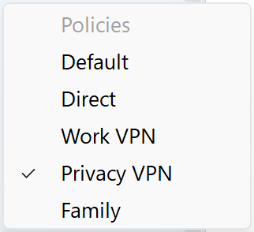
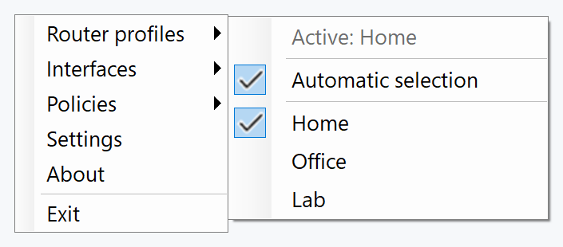
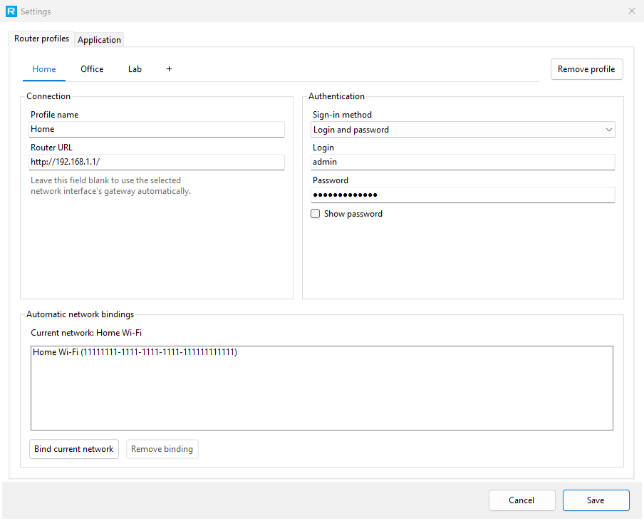
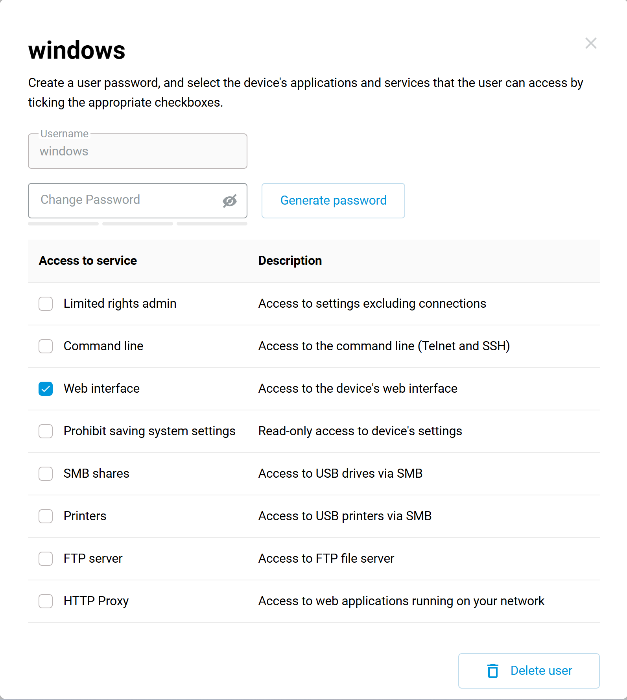

<p align="center">
  <a href="README.md">English</a> · <strong>Русский</strong>
</p>

<p align="center">
  
</p>

<h1 align="center">RouterTray</h1>

<p align="center">
  <strong>Быстро переключайте политики доступа Keenetic и Netcraze из трея Windows.</strong>
</p>

<p align="center">
  Небольшая утилита, с которой не придётся каждый раз открывать веб-интерфейс роутера.
</p>

<p align="center">
  <a href="https://github.com/den67rus/routertray/actions/workflows/release.yml"></a>
  
  <a href="LICENSE"></a>
</p>

<p align="center">
  <a href="https://github.com/den67rus/routertray/releases"><strong>Скачать</strong></a>
  ·
  <a href="#быстрый-старт">Быстрый старт</a>
  ·
  <a href="#если-что-то-не-работает">Решение проблем</a>
</p>

<p align="center">
  
</p>

Если на роутере настроено несколько политик доступа, RouterTray переносит их в системный трей. Нажмите на значок и выберите нужную политику. Роутер применит её к текущему компьютеру, а активная политика будет отмечена галочкой.

> [!NOTE]
> RouterTray не является VPN-клиентом и ничего не маршрутизирует сам. Он только переключает уже созданные в Keenetic или Netcraze политики для MAC-адреса выбранного сетевого адаптера.

## Что умеет

- **Переключать политику одним щелчком.** Левый клик по значку открывает короткое меню без лишних окон.
- **Работать с несколькими роутерами.** Для дома, офиса или другой сети можно создать отдельный профиль со своими настройками.
- **Сам выбирать профиль.** Привяжите профиль к сети Windows, и RouterTray переключится на него при подключении.
- **Находить роутер через шлюз.** Если оставить URL пустым, программа возьмёт шлюз выбранного сетевого интерфейса.
- **Работать с нужным адаптером.** Можно оставить автоматический выбор или вручную указать Ethernet, Wi-Fi либо другой интерфейс.
- **Входить по паролю или токену.** Авторизация по токену доступна начиная с прошивки 5.2.
- **Хранить секреты не в открытом виде.** Пароли и токены защищаются через Windows DPAPI.
- **Запускаться вместе с Windows по желанию.**
- **Обновляться автоматически.**

## Управление из трея

Левый клик открывает быстрый выбор политики. По правому клику доступны профили роутеров и сетевые интерфейсы.

<p align="center">
  
</p>

| Что нажать | Что произойдёт |
| --- | --- |
| **Левый клик по значку** | Откроется быстрый выбор политики. |
| **Правый клик → Профили роутеров** | Можно включить автовыбор или вручную сменить профиль. |
| **Правый клик → Интерфейсы** | Можно выбрать сетевой адаптер, с которым будет работать программа. |
| **Правый клик → Политики** | Откроется тот же список политик в обычном контекстном меню. |

## Профили роутеров

Профиль роутера хранит данные для подключения к нему: адрес, способ входа, логин и пароль либо токен, а также выбранный сетевой интерфейс.

К одному профилю можно привязать несколько сетей Windows, например домашний Wi-Fi и проводное подключение. Когда компьютер подключается к одной из них, RouterTray использует данные для входа из привязанного профиля. Каждая сеть может быть привязана только к одному профилю.

<p align="center">
  
</p>

## Быстрый старт

### 1. Установите RouterTray

Установщики и портативные версии публикуются на странице [Releases](https://github.com/den67rus/routertray/releases). Для большинства компьютеров подойдёт x64.

| Устройство | Установщик | Портативная версия |
| --- | --- | --- |
| Большинство компьютеров Intel/AMD | `RouterTray.App-win-x64-Setup.exe` | `RouterTray.App-win-x64-Portable.zip` |
| Windows on ARM | `RouterTray.App-win-arm64-Setup.exe` | `RouterTray.App-win-arm64-Portable.zip` |
| 32-разрядная Windows | `RouterTray.App-win-x86-Setup.exe` | `RouterTray.App-win-x86-Portable.zip` |

Установщик не требует прав администратора и ставит программу только для текущего пользователя.

### 2. Подготовьте роутер

Сначала создайте в веб-интерфейсе Keenetic или Netcraze политики, между которыми будете переключаться. RouterTray работает с уже готовыми политиками и не меняет их настройки.

Для входа по логину и паролю можно использовать учётную запись администратора или завести отдельного пользователя для RouterTray. Задайте ему имя и пароль, затем разрешите доступ только к **веб-интерфейсу**. Остальные права программе не нужны.

<p align="center">
  
</p>

На прошивке 5.2 или новее вместо логина и пароля можно использовать токен доступа.

### 3. Добавьте профиль

1. Запустите RouterTray и найдите синий значок **R** рядом с часами. Возможно, он будет спрятан в меню дополнительных значков.
2. Нажмите на него правой кнопкой и выберите **Настройки**.
3. Задайте имя профиля.
4. Укажите URL роутера. Если это обычный роутер в текущей сети, поле можно оставить пустым. RouterTray попробует найти его через шлюз.
5. Выберите способ входа и введите учётные данные.
6. Если профилей несколько, нажмите **Привязать текущую сеть**.
7. Нажмите **Сохранить**.

### 4. Выберите политику

Нажмите на значок RouterTray левой кнопкой и выберите нужную политику. Пункт **По умолчанию** убирает явное назначение и возвращает стандартную политику роутера.

## Как работает переключение

При переключении RouterTray делает несколько шагов.


1. RouterTray смотрит, к какой сети подключён компьютер, например к домашнему Wi-Fi или проводной сети.
2. По этой сети программа выбирает привязанный профиль. В нём хранятся адрес роутера, данные для входа и нужный сетевой адаптер.
3. RouterTray подключается к роутеру через локальный API и получает список доступных политик.
4. После выбора роутер назначает политику MAC-адресу сетевого адаптера. MAC-адрес является идентификатором, по которому роутер узнаёт этот компьютер.

Если одновременно используются Ethernet, Wi-Fi или виртуальные адаптеры, профиль роутера и нужный адаптер можно выбрать вручную.

## Что поддерживается

| Компонент | Поддержка |
| --- | --- |
| Система | Windows |
| Архитектуры | x64, x86, ARM64 |
| Роутер | Keenetic или Netcraze с локальным RCI API |
| Авторизация | NDW2/NDW4; токен доступа требует прошивку 5.2 или новее |

## Где лежат настройки

- Основной файл: `%LOCALAPPDATA%\RouterTray\appsettings.json`.
- Лог: `%LOCALAPPDATA%\RouterTray\routertray.log`.
- Пароли и токены сохраняются через Windows DPAPI в области `CurrentUser`.
- RouterTray обращается к роутеру по локальной сети. Если автоматическая проверка обновлений включена, единственный внешний запрос выполняется к GitHub Releases этого репозитория.
- Версия, установленная через Velopack, находится в `%LOCALAPPDATA%\RouterTray.App`; пользовательские настройки остаются в `%LOCALAPPDATA%\RouterTray` и не заменяются при обновлении.

## Если что-то не работает

<details>
<summary><strong>Не вижу значок RouterTray</strong></summary>

Проверьте меню скрытых значков рядом с часами. RouterTray может работать только в одном экземпляре. Если программа уже запущена, при повторном открытии новое окно не появится, поэтому может показаться, что ничего не произошло.

</details>

<details>
<summary><strong>В списке нет политик</strong></summary>

Проверьте, что политики созданы на роутере и доступны выбранной учётной записи. Затем нажмите правой кнопкой по значку и откройте **Политики**. Программа обновит список.

</details>

<details>
<summary><strong>Для текущей сети не найден профиль</strong></summary>

Откройте **Настройки**, выберите профиль и нажмите **Привязать текущую сеть**. Либо отключите автоматический выбор и укажите профиль вручную через меню в трее.

</details>

<details>
<summary><strong>Выбран не тот сетевой адаптер</strong></summary>

Откройте в меню пункт **Интерфейсы** и выберите адаптер, подключённый к роутеру. От него зависят адрес шлюза и MAC-адрес, для которого меняется политика.

</details>

<details>
<summary><strong>Не удаётся подключиться к роутеру</strong></summary>

Проверьте URL и данные для входа. Адрес должен начинаться с `http://` или `https://`, например `http://192.168.1.1/`. Если роутер является шлюзом текущей сети, попробуйте оставить URL пустым.

Подробности ошибки будут в `%LOCALAPPDATA%\RouterTray\routertray.log`.

</details>

## Сборка из исходников

Понадобятся Windows и [.NET 8 SDK](https://dotnet.microsoft.com/download/dotnet/8.0).

```powershell
git clone https://github.com/den67rus/routertray.git
cd routertray

dotnet restore tests/RouterTray.Tests/RouterTray.Tests.csproj
dotnet tool restore
dotnet build RouterTray.csproj -c Release --no-restore -warnaserror
dotnet test tests/RouterTray.Tests/RouterTray.Tests.csproj -c Release --no-restore
```

Для сборки выберите нужную платформу: `win-x64`, `win-arm64` или `win-x86`.

```powershell
dotnet publish RouterTray.csproj -c Release -r win-x64 --self-contained true -o artifacts/publish/win-x64
```

## Как помочь

Нашли баг или хотите предложить улучшение? Создайте [Issue](https://github.com/den67rus/routertray/issues). Небольшие пул-реквесты тоже приветствуются.

## Лицензия

RouterTray распространяется по [лицензии MIT](LICENSE).
